# 🏗️ System Architecture Notes

**Author:** Peter Mumo  
**Project:** RestPoint Software Backend API  
**Last Updated:** October 2025

---

## 🧠 Overview

The RestPoint Software Backend is a **containerized, event-driven Node.js system** supporting mortuary operations management — including document generation, real-time monitoring, and intelligent automation (AI models).

It is built using:

- **Express.js** (API Framework)
- **MySQL** (Primary Database)
- **Redis Cache** (Performance Optimization)
- **Docker & Docker Compose** (Orchestration)
- **Socket.IO** (Real-Time Updates)
- **GitHub Actions** (CI/CD)

---

## 🗺️ High-Level Architecture (Mermaid Diagram)

```mermaid
graph TD

subgraph CLIENT["🧑‍💻 Frontend / Staff Portal"]
    A1["React Web App"]
    A2["Electron Desktop App"]
    A1 -->|HTTPS| B1
    A2 -->|WebSocket| B4
end

subgraph BACKEND["🧩 Backend API (Node.js)"]
    B1["Express REST API"]
    B2["Controllers (Deceased, Hearse, Invoice, etc.)"]
    B3["Helpers & Middleware (Auth, Validation, Encryption)"]
    B4["QueueEmitter (Socket.IO Real-time Channel)"]
    B5["Services (Print, DB, Document Generator)"]
    B6["Utilities (AI, WhatsApp, Health Monitor)"]

    B1 --> B2
    B2 --> B3
    B3 --> B4
    B3 --> B5
    B5 --> B6
end

subgraph STORAGE["🗄️ Data & Storage"]
    C1["MySQL Database"]
    C2["Uploads Directory (Documents, Images)"]
    C3["Redis Cache"]
    C4["Logs & Backups"]
end

subgraph INFRA["🐳 Dockerized Infrastructure"]
    D1["Dockerfile (Node 18)"]
    D2["docker-compose.yml"]
    D3["GitHub Actions Workflow"]
end

A1 -->|API Calls| B1
B5 -->|Queries| C1
B6 -->|Cache Writes| C3
B4 -->|Broadcast Events| A1
B5 -->|File Output| C2
B3 -->|Audit Logs| C4
INFRA -.-> BACKEND
```

